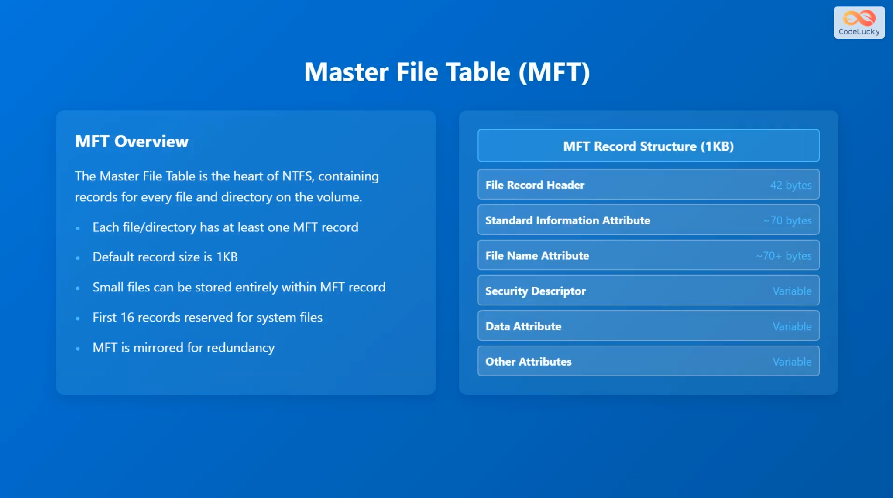

# Raw MFT Read Internals

This document explains how the current `RawMft` implementation reads and parses the NTFS `$MFT`, and how the chunked and parallel execution paths are built on top of the same core reader.

The relevant code lives in:

- `src/raw_mft/mod.rs`
- `src/raw_mft/bootstrap/`
- `src/raw_mft/entry_build/`
- `src/raw_mft/reader.rs`
- `src/raw_mft/attr_list.rs`
- `src/raw_mft/serial/`
- `src/raw_mft/parallel/`
- `src/raw_mft/io.rs`
- `src/raw_mft/ondisk/`
- `src/raw_mft/chunk_plan.rs`
- `benches/raw_mft_ingest.rs`
- `examples/raw_mft_parallel_chunks.rs`

## Scope and constraints

- `RawMft` is NTFS-only. ReFS returns `UsnError::UnsupportedFilesystem` during `RawMft::new`.
- Opening the volume requires Administrator privileges because the crate opens the raw volume handle directly.
- The raw reader is not using `FSCTL_ENUM_USN_DATA`. It reads the `$MFT` file itself, interprets NTFS on-disk structures, and yields richer metadata than the FSCTL-based `Mft` API.

## High-level pipeline

At a high level the implementation does this:

1. Open the raw volume.
2. Read and validate the NTFS boot sector.
3. Read FILE record 0, which is the `$MFT` record.
4. Decode `$MFT`'s unnamed `$DATA`(primary data stream) runs into an `ExtentMap`.
5. Decode and materialize `$MFT`'s `$BITMAP` stream into memory.
6. For each requested record number:
   - optionally consult the bitmap,
   - translate record number to a volume byte offset,
   - borrow the record bytes from a sector-aligned reader buffer,
   - validate and fix up the FILE record,
   - build a `RawMftEntry`,
   - optionally enrich it from `$ATTRIBUTE_LIST` extension records.
7. Optionally group record-number ranges into chunks and process those chunks in parallel.

The same parsing path is reused for:

- serial scans via `RawMft::try_iter` / `RawMft::try_iter_with_options`,
- single-chunk parsing via `RawMft::read_chunk`,
- parallel batch parsing via `RawMft::parallel().for_each_batch`,
- parallel folded parsing via `RawMft::parallel().fold_chunks`.

## Core types and responsibilities

Screenshot from: [YouTube](https://www.youtube.com/watch?v=PQbGTP0bR9o&t=229s)

### `Volume`

`src/volume.rs` owns the Windows volume handle and remembers how it was opened:

- drive letter, or
- mount point.

That source information matters for parallel reads because each worker thread reopens its own handle instead of sharing one mutable reader.

### `BootSector`

`src/raw_mft/ondisk/boot.rs` parses the first 512 bytes of the volume and extracts:

- `bytes_per_sector`,
- `cluster_size`,
- `file_record_size`,
- `mft_lcn`,
- `mft_byte_offset`.

This is the geometry the rest of the reader uses.

### `ExtentMap`

`src/raw_mft/ondisk/extent.rs` converts the unnamed `$DATA` runs of `$MFT` into a mapping from logical record number to physical byte offset on disk.

The important detail is that the reader does not assume the `$MFT` is contiguous. The extent map can represent:

- normal runs, and
- sparse holes.

`ExtentMap::record_offset_with_cursor` also accepts an `ExtentLookupCursor`, which lets sequential scans avoid restarting the segment search from the beginning for every record.

### `VolumeReader`

`src/raw_mft/io.rs` wraps the raw Windows handle with a sector-aligned buffered reader.

This exists because raw volume reads on Windows must respect sector alignment. `VolumeReader` exposes a byte-oriented interface anyway by:

- aligning internal refill offsets to sector boundaries,
- keeping a sector-aligned backing buffer,
- letting higher layers borrow slices out of that buffer with `borrow_at`.

The main performance win is that the iterator can parse FILE records directly out of the internal buffer instead of copying each record into a temporary allocation first.

### `FileRecord`

`src/raw_mft/ondisk/record.rs` validates and fixes up one FILE record.

The flow is:

1. `is_valid` performs cheap structural checks.
2. `parse` applies the update-sequence-array fixup in place.
3. The parsed view exposes helpers such as:
   - `is_used`,
   - `is_directory`,
   - `base_reference`,
   - `attrs_range`,
   - `file_reference`.

### `RawMftEntry`

`src/raw_mft/entry_build/entry.rs` turns one parsed FILE record into the public high-level entry type.

It collects:

- timestamps,
- file attributes,
- chosen file name and namespace,
- parent reference,
- real and allocated size,
- resident/non-resident state,
- sparse/compressed/encrypted flags,
- alternate data streams,
- all discovered file-name links.

It also captures `$ATTRIBUTE_LIST` information for later enrichment.

## Initialization path: `RawMft::new`

`RawMft::new` performs all one-time setup needed for later scans, with the
FILE record 0 stream discovery and bitmap loading split into
`src/raw_mft/bootstrap/discovery.rs`.

### 1. Open a temporary reader and parse the boot sector

The function starts with `VolumeReader::new(volume.handle, 512)` because the NTFS boot sector is always read as the first 512-byte sector.

After `BootSector::parse` succeeds, the reader is recreated using the real `bytes_per_sector` from the volume. That matters on volumes whose physical sector size is not 512 bytes.

### 2. Read FILE record 0

The implementation seeks to `boot.mft_byte_offset` and reads one FILE record. FILE record 0 is the `$MFT` record itself.

`FileRecord::parse` is then used to validate the record and apply USA fixups.

### 3. Walk attributes on FILE record 0

The attribute walk looks for two unnamed/non-resident attributes:

- `$DATA`: this describes where the `$MFT` stream lives on disk.
- `$BITMAP`: this marks which MFT record numbers are currently in use.

The implementation decodes both run lists with `decode_runs`.

### 4. Build shared immutable state

From those decoded runs the constructor builds:

- `extent_map: Arc<ExtentMap>` from `$MFT::$DATA`,
- `bitmap: Arc<[u8]>` by reading `$MFT::$BITMAP` into memory.

The bitmap is fully materialized once so later unused-record filtering checks are just in-memory bit tests.

The final `RawMft` value contains:

- the borrowed `Volume`,
- parsed boot geometry,
- the shared extent map,
- the shared bitmap.

That state is cheap to clone into worker-local reader contexts later because the large shared pieces are behind `Arc`.

## Serial read path

The public serial path is `RawMft::try_iter_with_options`, which constructs `RawMftIter`.

### Reader setup

`RawMftIter` owns two `VolumeReader` instances:

- `reader`: the main sequential reader for record-by-record scanning,
- `attr_reader`: a second reader used for attribute-list extension lookups.

The second reader is deliberate. Extension reads are random-access and would otherwise disturb the main sequential reader's buffer window.

### Iteration loop

`RawMftIter::next` walks `next_record..end` and applies the following steps for each record number.

#### 1. Exclude unused records unless requested

If `options.include_unused_records` is `false`, the iterator calls `bitmap_used(record_number)` and skips records whose bit is clear.

This is an in-memory bit lookup against the bitmap loaded during `RawMft::new`.

#### 2. Translate record number to disk offset

The iterator calls `extent_map.record_offset_with_cursor(record_number, &mut offset_cursor)`.

This handles:

- fragmented `$MFT` extents,
- sparse regions,
- cursor-based acceleration for sequential scans.

If the record falls into a sparse hole, the iterator skips it.

#### 3. Borrow the record bytes

The iterator calls `reader.borrow_at(offset, record_size)`.

This is one of the important implementation details:

- the returned slice points directly into the internal aligned buffer,
- the buffer is refilled only when the requested bytes are not already present,
- there is no per-record memcpy on the fast path.

#### 4. Validate and parse the FILE record

The iterator first calls `FileRecord::is_valid` for a cheap rejection path.

If that succeeds, it calls `FileRecord::parse`, which applies the USA fixup in place and returns a typed view over the record.

Parse failures are logged and skipped. They do not terminate the whole scan.

#### 5. Reject extension records early

Before building the high-level entry, the iterator reads `base_reference` from the
parsed FILE record header.

If `base_reference != 0`, the iterator discards the record immediately. No
attribute walk is performed.

Extension records are explained in detail in the
[Record filtering for Explorer-like output](#record-filtering-for-explorer-like-output)
section.

#### 6. Build the high-level entry

The iterator calls `RawMftEntry::from_record_with_attr_list(&rec, build_options)`.

This produces:

- a `RawMftEntry`, and
- optional `AttributeListInfo` when the record carries `$ATTRIBUTE_LIST`.

The builder collects attributes from the base record only at this stage.

#### 7. Optionally enrich from `$ATTRIBUTE_LIST`

If the record carries an attribute list and `should_enrich_from_attr_list(&entry)` returns true, the iterator calls `enrich_from_attr_list`.

That path is described in detail below.

## Entry materialization and attribute-list enrichment

### Base-record attribute collection

`RawMftEntryBuilder` walks the attributes in a parsed FILE record and folds in:

- `$STANDARD_INFORMATION`,
- `$FILE_NAME`,
- `$DATA`,
- `$REPARSE_POINT`,
- `$ATTRIBUTE_LIST`.

Important behavior:

- The best `$FILE_NAME` namespace wins. The namespace score prefers `Win32AndDos` over `Win32`, then `Posix`, then `Dos`.
- The builder can suppress shadowed DOS 8.3 names when `collect_dos_file_name_links` is false.
- Unnamed `$DATA` becomes the main size and storage metadata.
- Named `$DATA` becomes `alternate_data_streams` when ADS collection is enabled.
- `$ATTRIBUTE_LIST` is preserved as either:
  - resident bytes, or
  - non-resident runlist metadata plus logical size.

### Why enrichment exists

Some files store important attributes in extension records rather than the base record, especially when the base FILE record overflows. A common example is a file whose long Win32 name lives in an extension record while the base record only carries a DOS 8.3 name.

### `attr_list_enrich_needs`

The reader only enriches when the current base entry is missing something useful:

- file-name improvement is needed,
- data attributes are missing on a non-directory,
- a reparse point is known but the tag is missing.

This avoids doing extension-record reads when the base entry is already sufficient.

### Enrichment steps

`enrich_from_attr_list` works like this:

1. Materialize the attribute-list payload.
   - resident lists are already inline,
   - non-resident lists are decoded with `decode_runs` and read with `read_nonresident`.
2. Walk the flat attribute-list entries.
3. Collect unique extension record numbers that contain attribute types the current entry still needs.
4. Load each extension record with `read_record_raw`.
5. Merge back better file names, missing data metadata, ADS entries, and reparse information.

Two design details matter here:

- The implementation supports both resident and non-resident `$ATTRIBUTE_LIST` values.
- Extension records are read one level deep only. `read_record_raw` does not recursively enrich extension records, which avoids unbounded recursion on pathological data.

## Chunk planning

Chunk planning lives in `src/raw_mft/chunk_plan.rs` and produces a deterministic vector of `RawMftWorkChunk { start_record, end_record }` values.

### What a chunk represents

A chunk is a logical range of MFT record numbers. It is not a promise that the underlying disk I/O is contiguous.

That distinction matters because:

- the `$MFT` itself may be fragmented,
- the planner works in record-number space,
- extent translation still happens record by record inside each chunk.

### Default planning behavior

`RawMftChunkPlanOptions::default()` uses:

- `include_unused_records = false`,
- `start_record = FIRST_NORMAL_RECORD` (24),
- `end_record = None` meaning `record_count()`,
- `max_records_per_chunk = 16 * 1024`.

### `build_work_chunks`

`build_work_chunks` walks the requested record-number range and creates chunks using two rules:

1. If `include_unused_records` is false, chunk bands with no used records at all are omitted.
2. A chunk never grows beyond `max_records_per_chunk` records.

That means the default planner tends to produce chunks that:

- drop fully unused chunk bands,
- remain bounded in size,
- preserve increasing record order.

If `include_unused_records` is true, the planner emits dense fixed-width logical windows even when a band is fully unused.

### Why planner behavior can differ from parser behavior

The planner and the parser each have their own `include_unused_records` setting.

That allows patterns like the ingest benchmark, which deliberately plans dense record-number windows but still lets each worker skip unused entries during parsing.

This is useful when you want more even chunk sizes without paying to build chunk boundaries around every hole in the bitmap.

## Parallel execution model

Parallel execution is layered on top of the exact same record parser used by serial iteration.

The public parallel facade is `RawMft::parallel()`. It exposes:

- `collect_batches`
- `for_each_batch`
- `map_chunks`
- `fold_chunks`

### Serial fallback

If the requested `worker_count` collapses to 1, the implementation falls back to serial chunk processing.

That keeps the code path predictable and avoids thread setup overhead when parallelism would not help.

### Reopening the volume per worker

The original `RawMft` only holds a borrowed `&Volume`, so worker threads cannot safely share a mutable `VolumeReader`.

Instead the parallel path first extracts a reusable volume source from the original `Volume` (drive letter or mount point):

- `DriveLetter(char)`, or
- `MountPoint(PathBuf)`.

Each worker then calls `open_parallel_volume` and gets its own fresh `Volume` handle.

If the original volume does not have a reusable source, the parallel APIs fail rather than trying to share a non-thread-safe reader.

### Shared vs worker-local state

Each worker constructs its own lightweight `RawMft` view containing:

- its own `Volume`,
- cloned `BootSector`,
- shared `Arc<ExtentMap>`,
- shared `Arc<[u8]>` bitmap.

Each worker also creates its own:

- main `VolumeReader`,
- attribute-list `VolumeReader`.

This is an intentional split:

- expensive immutable discovery state is shared,
- mutable I/O buffers and file handles stay thread-local.

### Work distribution

The worker threads use one shared `AtomicUsize` called `next_index`.

Each worker repeatedly does:

1. `index = next_index.fetch_add(1, Ordering::Relaxed)`
2. stop if `index >= chunks.len()`
3. process `chunks[index]`
4. send the result back through an `mpsc` channel

This is a simple dynamic scheduling model:

- no dedicated queue object,
- no static chunk-to-thread assignment,
- faster workers naturally pick up more chunks.

### Deterministic output ordering

Workers finish out of order, but the public visitor still sees results in chunk order.

The coordinating thread stores each `(index, payload)` into a `pending[index]` slot and only calls the visitor once `next_expected` is available.

So the guarantees are:

- chunk processing is concurrent,
- chunk completion order is nondeterministic,
- callback visitation order is deterministic and matches the planned chunk vector.

The integration test `tests/raw_mft_parallel_chunk_consistency.rs` checks that parallel chunk results preserve chunk order and match serial chunk output.

### Error behavior

Any worker can send `Err(UsnError)` over the channel. The coordinator returns the first error it receives.

The implementation also turns these cases into errors:

- channel closed unexpectedly,
- worker panic.

### Mapped vs folded parallel APIs

There are two useful shapes above the common executor.

#### Mapped chunk API

`RawMft::parallel().map_chunks(...)` parses a chunk into `RawMftChunkBatch`, applies a worker-side mapping function, and emits the mapped result in deterministic order.

Use this when the natural unit of work is still a chunk-sized batch.

#### Folded chunk API

`RawMft::parallel().fold_chunks(...)` creates a worker-local accumulator per chunk with `init(chunk)`, then folds each `RawMftBatchEntry` into that accumulator with `fold_entry(&mut acc, entry)`.

Use this when you want to avoid building a large intermediate `Vec<RawMftBatchEntry>` for every chunk.

This is the path used by the current ingest benchmark because it minimizes intermediate allocation and lets each worker return a compact per-chunk result to the coordinator.

## Current ingest benchmark behavior

`benches/raw_mft_ingest.rs` is a good example of how the current chunked path is intended to be consumed.

### What it is optimizing for

The benchmark is not trying to expose every bit of `RawMftEntry`. It is measuring high-throughput ingest into a compact in-memory representation.

So it deliberately trims work by using iterator options that disable several expensive or unnecessary pieces of metadata:

- `collect_alternate_data_streams(false)`
- `collect_data_run_summary(false)`
- `collect_dos_file_name_links(false)`

It also tunes the reader buffers:

- main buffer default: 512 KiB,
- attribute buffer default: 16 KiB.

### Planner choices in the benchmark

The benchmark's `RawMftChunkPlanOptions` use:

- `include_unused_records: true`,
- `start_record`: configurable, default 24,
- `end_record`: optional,
- `max_records_per_chunk`: configurable, default 16384 records.

This is a subtle but important choice.

The benchmark plans dense logical windows but still parses with `RawMftScanOptions::default()` for `include_unused_records`, which remains false unless explicitly changed. In other words:

- chunk planning does not split at unused-record gaps,
- the parser inside each worker still skips unused records.

That tends to produce more regular chunk sizes for the executor while still avoiding full parsing work for deleted/unused records.

### Folded worker output

Each worker allocates a `PartialIngest` sized to the chunk length and folds entries into:

- a `records` vector keyed by record number,
- a `child_links` vector grouped later by parent record number.

The main thread then merges those worker-local partials into shared benchmark targets in deterministic chunk order.

### Worker-count policy in the benchmark

The benchmark defaults to half of the available parallelism, clamped to the range `1..=8`.

That is an intentionally conservative default rather than "always use every logical CPU".

## Why the design performs well

The current reader gets most of its performance from a small number of deliberate choices:

- One-time discovery of boot geometry, extent layout, and bitmap.
- In-memory bitmap checks instead of repeated on-disk filtering.
- Direct parsing out of `VolumeReader::borrow_at` instead of per-record memcpy.
- Cursor-based extent lookups for sequential record-number scans.
- Separate extension-record reader to avoid thrashing the sequential reader window.
- Chunk-level parallelism with dynamic work distribution.
- Deterministic ordered merge at chunk granularity instead of record granularity.
- Folded parallel ingestion when the consumer does not need to retain full batch objects.

## Record filtering and normalization for Explorer-like output

The raw-MFT reader applies one configurable filter plus one built-in
normalization step to produce a "current live filesystem" view — the same set
of entries Windows Explorer shows.

### In-use filtering (`include_unused_records`, default `false`)

When `include_unused_records` is `false`, the reader consults the `$MFT` `$BITMAP` loaded during
`RawMft::new` before touching a FILE record on disk.

- The `$BITMAP` is loaded once into memory (`Arc<[u8]>`) at construction time.
- Each lookup is an in-memory bit test: byte `n / 8`, bit `n % 8`.
- Records whose bit is clear are skipped before the extent translation, buffer
  borrow, validation, and parse steps, making the check essentially free.

If `$BITMAP` is unavailable, `bitmap_used` returns `true` for all records, so
the reader can no longer reject unused slots early. In that case iteration falls
back to best-effort parsing of every addressable record and callers must inspect
`RawMftEntry::is_used` themselves.

### Extension-record filtering (always on)

#### What extension records are

An NTFS FILE record is exactly 1 KB.  Most files fit in a single record — the
**base record**.  Some files cannot:

- files with many hard links generate many `$FILE_NAME` attributes,
- highly fragmented files generate long data-run lists,
- files with many alternate data streams accumulate many `$DATA` attributes.

When the base record overflows, NTFS allocates one or more additional FILE records
called **extension records** to hold the surplus attributes.  The base record then
carries a `$ATTRIBUTE_LIST` attribute that lists which attribute lives in which record.

Extension records can be identified by a single header field: the 8-byte
`base_reference` at offset 0x20.

- **Base record**: `base_reference == 0`.
- **Extension record**: `base_reference` holds the full file reference (record
  number in the lower 48 bits, sequence number in the upper 16 bits) of the base
  record.

#### Why filtering matters

Extension records are *overflow storage*, not separate files.  A 5,000-link file
still represents one logical entry, even if its `$FILE_NAME` attributes span three
or four MFT records.

If extension records are not filtered, the iterator yields one entry per FILE
record, so the same file appears multiple times — once as the base entry and once
(or more) as partial, attribute-incomplete extension views.

The reader always rejects each extension record immediately after the USA fixup
and before the expensive attribute walk, keeping one output entry per unique
file or directory.

#### Interaction with `$ATTRIBUTE_LIST` enrichment

Skipping extension records from the *output stream* does not affect enrichment.
When the base record carries a `$ATTRIBUTE_LIST` attribute, the enrichment path
still reads the relevant extension records, merges better file names or missing
data attributes back into the base entry, and then discards the extension record
without returning it to the caller.

### Sequence numbers

Every FILE record header carries a 16-bit `sequence_value`.  NTFS increments this
value each time a record is reused for a new file.

NTFS directory-index entries and `$ATTRIBUTE_LIST` entries reference files using
a 64-bit file reference:

- **lower 48 bits**: MFT record number,
- **upper 16 bits**: sequence number at the time the reference was written.

A sequence-number mismatch between a stored reference and the current record header
means the record has been reused — the original file was deleted and a new one now
occupies that slot.

The current `PathResolver::with_in_memory_tree` implementation intentionally
discards the sequence bits when keying the directory tree by record number.  A
stale file reference therefore resolves to the *current occupant* of that record
number rather than returning `None`.  This is a deliberate trade-off: the in-memory
tree is built from a single-point-in-time MFT scan so internal references are
always consistent within that snapshot, and the simpler lookup avoids a separate
sequence-validation step per path component.

If you need strict sequence validation (for example, to detect reused records in a
diff against an older snapshot), call `Fid::sequence()` and compare it against
`FileRecord::sequence_value()` before accepting the resolved path.

### Summary: default filter chain

With factory defaults, each record number passes through these gates in order:

1. **Bitmap check** (`include_unused_records = false`): skip if bit clear → most deleted
   records are rejected here, before any disk I/O on the record itself.
2. **Extent translation**: skip sparse holes.
3. **Buffer borrow**: bring record bytes into the aligned reader buffer.
4. **Signature check** (`FileRecord::is_valid`): reject non-FILE records.
5. **USA fixup** (`FileRecord::parse`): verify and repair sector trailers.
6. **Extension-record check**: reject records whose `base_reference != 0`
   before the attribute walk.
7. **Attribute walk + entry build**: produce one `RawMftEntry` per base record.
8. **`$ATTRIBUTE_LIST` enrichment** (when needed): load overflow attributes from
   extension records and merge them into the base entry.

The result is one entry per currently live file or directory, matching the view
that Windows Explorer presents.

- Chunk boundaries are logical record ranges, not physical extent boundaries.
- Invalid FILE records are skipped unless the error is fatal to the scan itself.
- Sparse regions in the extent map are skipped.
- Parallel chunk parsing requires the original `Volume` to be reopenable from a drive letter or mount point.
- Attribute-list enrichment is intentionally one level deep.
- Extension records are never yielded as standalone entries, but base records can still be enriched from them.

## Practical mental model

If you want the shortest accurate summary of the current implementation, it is this:

1. `RawMft::new` discovers how `$MFT` is laid out on disk and caches the usage bitmap.
2. The serial parser walks record numbers, translates them through the extent map, and parses FILE records directly out of a sector-aligned buffer.
3. `RawMftEntry` materialization is base-record-first, with optional one-level `$ATTRIBUTE_LIST` enrichment.
4. Chunking is just deterministic record-range planning.
5. Parallelism means "multiple worker-local readers running the same parser over different chunks, then merging results back in original chunk order".

That model is enough to reason about almost all performance and correctness changes in the current raw-MFT code.
