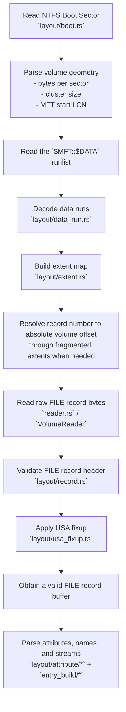

# `raw_mft`

This directory contains the internal implementation of the raw NTFS `$MFT` reader.

The code here is organized by responsibility:

- `layout/` — on-disk NTFS structures and low-level parsers
- `reader.rs` — reads raw FILE records from the volume
- `entry_build/` — builds higher-level `RawMftEntry` values
- `bootstrap/` — discovers the `$MFT` streams and prepares the scan
- `serial/` and `parallel/` — scanning engines
- `chunk_plan.rs` — chunk planning for parallel scans
- `io.rs` — sector-aligned volume I/O helpers
- `options.rs` — internal scan and entry options
- `tests.rs` — module-level tests

## Raw MFT read flow



## What `extent.rs` does

```mermaid
flowchart TD
    A[Decoded `DataRun` list] --> B[`ExtentMap::from_runs()`]
    B --> C[Store VCN-to-LCN segments]
    C --> D[`record_offset(record_number)`]
    D --> E[Convert record number to VCN]
    E --> F[Find matching extent segment]
    F --> G{Segment is sparse?}
    G -- Yes --> H[Return `None`]
    G -- No --> I[Compute absolute byte offset]
    I --> J[Return disk offset]

    D --> K[`record_offset_with_cursor()`]
    K --> L[Reuse cached segment index]
    L --> F
```

`extent.rs` turns the `$MFT` runlist into a lookup structure for:

> `record number -> absolute disk byte offset`

It is needed because the `$MFT` is often **not stored contiguously** on disk. A simple formula like `mft_start + record_number * file_record_size` only works when the MFT is effectively one contiguous extent. When a caller wants to read record `N`, the code first needs to determine which extent segment contains that record and where that segment maps on the volume.

## Short summary

```text
boot sector
  -> MFT runlist
  -> data runs
  -> extent map
  -> record offset
  -> read FILE record
  -> USA fixup
  -> parse attributes
```

## Notes

- This README is intentionally internal and describes the implementation structure of `raw_mft`.
- The diagrams are written in English so they can be reused in docs or design notes.

